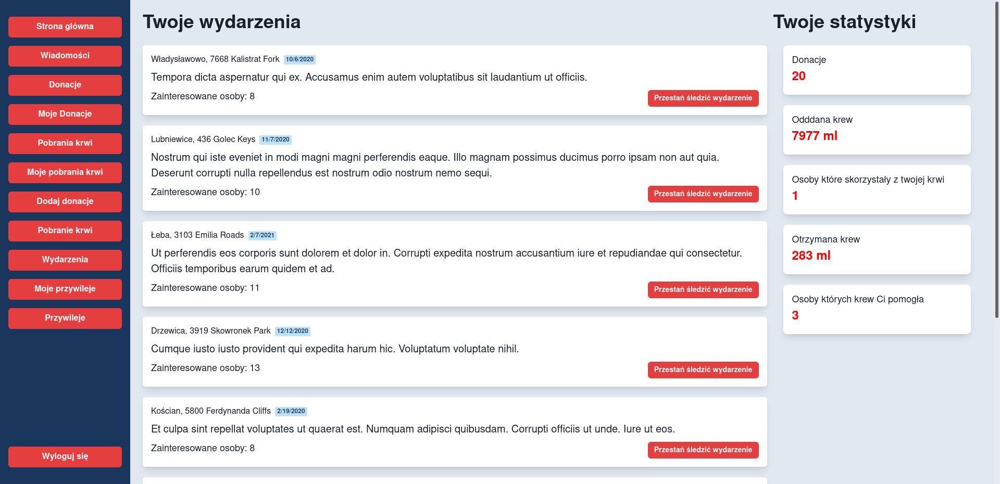

# Aplikacja wspomagająca centrum krwiodawstwa

## Mini-projekt z przedmiotu Bazy danych, semestr 4, rok akademicki 2020/2021

## Spis treści

- [Autorzy](#autorzy)
- [Opis projektu](#opis-projektu)
- [Wykorzystane technologie](#wykorzystane-technologie)
- [Uruchomienie projektu](#uruchomienie-projektu)
- [Struktura projektu](#struktura-projektu)
- [Struktura bazy danych](#struktura-bazy-danych)
- [Role](#role)
- [Interfejs aplikacji](#interfejs-aplikacji)

## Autorzy

- Barbara Kulawska ([@bkulawska](https://github.com/bkulawska))
- Kinga Sąkól ([@kingasakol](https://github.com/kingasakol))
- Jan Zborowski ([@john-sonz](https://github.com/john-sonz))

## Opis projektu

W bazie danych przechowywane są dane dawców i biorców krwi, informacje o poszczególnych donacjach i przekazaniach krwi biorcom, a także o eventach donacyjnych.

Pracownikom Centrum aplikacja zapewnia dostęp do informacji o aktualnym stanie zasobów krwi, o wszystkich donacjach i pobraniach oraz możliwość zarządzania tymi danymi i wprowadzania nowych donacji i pobrań do bazy.

Dawcom krwi aplikacja umożliwia monitorowanie dat i ilości oddanej krwi, a także dodatkowych przywilów z tym związanych.

Biorcom aplikacja umożliwia monitorowanie dat i ilości pobranej krwi, a także wysłanie wiadomości/podziękowania osobie, od której otrzymali krew.

## Wykorzystane technologie

### Baza danych

- [PostgreSQL](https://www.postgresql.org/) - system zarządzania relacyjną bazą danych z rozszerzeniami obiektowymi, udostępniany na licencji open source.

### Backend

- [Node.js](https://nodejs.org) - środowisko uruchomieniowe do tworzenia aplikacji serwerowych za pomocą języka JavaScript.
- [TypeScript](https://www.typescriptlang.org/) - język programowania stanowiący nadzbiór JavaScriptu, umożliwiający przede wszystkim statyczne typowanie kodu.
- [TypeORM](https://typeorm.io) - mapper obiektowo-relacyjny dla JavaScriptu, wykorzystywany do wykonywania operacji na bazie danych.
- [Express](https://expressjs.com/) - lekki framework do budowy aplikacji internetowych dla platformy Node.js.

### Frontend

- [React](https://reactjs.org/) - JavaScriptowa biblioteka wykorzystywana do budowy interfejsów graficznych i aplikacji typu SPA.
- [ChakraUI](https://chakra-ui.com/) - biblioteka dostarczająca gotowe komponenty do budowy aplikacji za pomocą React'a.

## Uruchomienie projektu

### Wymagania:

- Node.js (najlepiej w wersji 15.14.0 lub nowszej)
- Docker for desktop

### Backend

Aby uruchomić backend wraz z bazą danych należy wykonać następujące polecenia:

```bash
git clone https://github.com/john-sonz/blood-centers.git
cd blood-centers/backend && npm update && npm install
cd .. && docker-compose up
```

Backendowe API będzie dostępne pod adresem http://localhost:4000.

W trakcie pracy nad aplikacją potrzebne będzię również uruchomienie kompilatora języka Typescript w osobnym terminalu:

```bash
# w katalogu backend
npm run watch
```

### Frontend

Aby uruchomić aplikację frontendową, należy najpierw uruchomić backend a następnie wykonać, następujące polecenia:

```bash
# w katalogu frontend
npm update && npm install
npm start
```

Dane logowania do konta *Administratora* to
- PESEL: `11111111111`
- hasło: `admin`

Hasłem do pozostałych kont znajdujących się w bazie danych jest `password`.

## Struktura projektu
```
.
├── backend
│   └── src
│       ├── api
│       ├── entities
│       ├── middleware
│       └── migrations
└── frontend
    ├── public
    └── src
        ├── components
        ├── contexts
        ├── guards
        ├── layouts
        ├── types
        ├── utils
        └── views
```
Projekt składa się z dwóch głównych części: `frontend` oraz `backend`.


W backendzie znajduje się cała polityka dotycząca bazy danych (operacje na bazie). W folderze `backend/src` znajdują się podfoldery: `api`, `entities`, `middleware`, `migrations`.
W folderze `api` znajduje się kod odpowiedzialny za połączenia naszej aplikacji z bazą danych oraz wykonywanie operacji. Np. autoryzacja użytkownika, dodawanie użytkownika, pobieranie donacji/pobrań krwi/wiadomości/wydarzeń danego użytkownika. Operacje związane z donacjami, pobraniami krwi, przywilejami, wiadomościami - dodawanie, usuwanie, szukanie po odpowiednim id.
Folder `entities` zawiera klasy encji bazy danych. W folderze `middleware` znajdują się funkcje, z których aplikacja korzysta podczas sprawdzania, czy dany użytkownik jest zalogowany.
W folderze `migrations` znajdują się migracje, które zostały stworzone dla bazy danych. Za wygenerowanie przykładowych danych odpowiedzialna jest migracja `...Seeds.ts`. Pozostałe migracje zawierają kod SQL, który tworzy potrzebne struktury w bazie danych.


W frontendzie znajdują się pliki odpowiedzialne za wygląd naszej aplikacji. W folderze `public` znajduje się główny `index.html`, natomiast pozostały kod znajduje się w folderze `src`.
w podfolderze `components` znajdują się komponenty wykorzystywane przy czekaniu na załadowanie danych bądź w przypadku błędu. Podfolder `guard` zawiera guardy dla zalogowanego użytkownika oraz admina. Podfolder `layouts` zawiera główne rozmieszczenia/układy naszej aplikacji. W podfolderze `views` znajdują się widoki generowane dla admina, widoki dla donacji, wydarzeń, wiadomości, przywilejów, pobrań krwi. Dodatkowo w odpowiednich podfolderach znajdują się widoki dla formularzy logowania, rejestracji, dodania usunięcia wcześniej wymienionych obiektów. Widoki dla admina posiadają obraz wszystkich donacji oraz pobiorów krwi znajdujących się w bazie. Użytkownik widzi tylko swoje donacje, pobiory krwi, wiadomości, przywileje, wydarzenia, którymi jest zainteresowany.
Ważnym plikiem w folderze src jest plik `routes.tsx`, który odpowiada za odpowiednie generowanie ścieżek oraz przekierowania.


## Struktura bazy danych


### Encje

`User`

```typescript
@Entity({ name: "users" })
export class User {
  @PrimaryGeneratedColumn("uuid")
  id: string;

  @Index({ unique: true })
  @Column()
  @IsNumberString()
  @Length(11)
  pesel!: string;

  @Column({ select: false })
  passwordHash!: string;

  @Column()
  @Length(2, 255)
  firstName!: string;

  @Column()
  @Length(2, 255)
  lastName!: string;

  @Column({
    type: "enum",
    enum: BloodType,
  })
  @IsEnum(BloodType)
  bloodType!: BloodType;

  @Column({ default: false })
  isAdmin: boolean;

  @OneToMany(() => Message, (msg) => msg.sender)
  sentMessages: Message[];

  @OneToMany(() => Message, (msg) => msg.recipient)
  receivedMessages: Message[];

  @OneToMany(() => Donation, (donation) => donation.donator)
  donations: Donation[];

  @OneToMany(() => Receipt, (receipt) => receipt.recipient)
  receipts: Receipt[];

  @ManyToMany(() => Event, (event) => event.interestedUsers)
  events: Event[];
}
```
Encja `User` reprezentuje użytkownika systemu. Użytkownicy są identyfikowani za pomocą unikalnych 11-cyfrowych numerów PESEL. Użytkownicy mogą oddawać krew oraz otrzymywać krew oddaną przez innych użytkowników. Użytkownicy mogą również śledzić informacje o wydarzeniach organizowanych przez centrum krwiodawstwa oraz wysyłać anonimowe wiadomości użytkownikom z których krwi skorzystali.

`Donation`

```typescript
@Entity({ name: "donations" })
export class Donation {
  @PrimaryGeneratedColumn("uuid")
  id: string;

  @Column({ type: "uuid" })
  donatorId!: string;

  @ManyToOne(() => User)
  @JoinColumn()
  donator!: User;

  @CreateDateColumn()
  date!: Date;

  @Column()
  amountMl!: number;

  @Column()
  availableMl!: number;

  @OneToMany(() => Receipt, (receipt) => receipt.donation)
  receipts: Receipt[];
}
```

`Donation` reprezentuje pojedynczą donację krwi dokonaną przez użytkownika. Zawiera informacje o dacie donacji, donatorze, ilości oddanej krwi oraz ilości krwi aktualnie dostępnej do pobrania z danej donacji.

`Receipt`

```typescript
@Entity({ name: "receipts" })
export class Receipt {
  @PrimaryGeneratedColumn("uuid")
  id: string;

  @Column({ type: "uuid" })
  recipientId!: string;

  @Column({ type: "uuid" })
  donationId!: string;

  @CreateDateColumn()
  date!: Date;

  @Column()
  amount!: number;

  @ManyToOne(() => Donation)
  @JoinColumn()
  donation!: Donation;

  @ManyToOne(() => User)
  @JoinColumn()
  recipient!: User;
}
```
Encja `Receipt` przechowuje informacje o pobraniu krwi z danej donacji przez biorcę.

`Event`

```typescript
@Entity({ name: "events" })
export class Event {
  @PrimaryGeneratedColumn("uuid")
  id: string;

  @Column()
  @Length(2, 255)
  city!: string;

  @Column()
  @Length(2, 255)
  address!: string;

  @Column()
  @Length(2, 255)
  description: string;

  @Column({ type: "timestamptz" })
  date!: Date;

  @ManyToMany(() => User, (user) => user.events, { cascade: true })
  @JoinTable({ name: "users_events_interests" })
  interestedUsers: User[];
}
```

Encja `Event` reprezentuje wydarzenie donacyjne. Zawiera informację o mieście i dokładnym adresie, gdzie wydarzenia się odbywa, o jego dacie i godzinie oraz opis.

`Message`

```typescript
@Entity({ name: "messages" })
export class Message {
  @PrimaryGeneratedColumn("uuid")
  id!: string;

  @Column({ type: "uuid" })
  senderId!: string;

  @Column({ type: "uuid" })
  recipientId!: string;

  @ManyToOne(() => User)
  @JoinColumn()
  sender!: User;

  @ManyToOne(() => User)
  @JoinColumn()
  recipient!: User;

  @Column({ type: "text" })
  @Length(1, 1024)
  text!: string;

  @CreateDateColumn()
  sentAt!: Date;
}
```

Encja `Message` reprezentuje wiadomość wysłaną od jednego użytkownika do drugiego. Zawiera informację o nadawcy i adresacie wiadomości, jej treść i czas wysłania.

`Privilege`

```typescript
@Entity({ name: "privileges" })
export class Privilege {
  @PrimaryGeneratedColumn("uuid")
  id: string;

  @Column()
  @Length(2, 255)
  description!: string;

  @Column()
  minDonatedAmountMl!: number;
}
```

Encja `Privilege` reprezentuje pojedynczy przywilej. Zawiera opis przywileju oraz informację, ile krwi trzeba oddać, by zaczął on przysługiwać.


## Role

W systemie zaplanowaliśmy dwie role: *Administrator* i *User*.

W systemie nie rozdzielamy użytkowników na dawców i biorców, gdyż ta sama osoba może być zarówno dawcą krwi, jak i czasem sama krwi potrzebować.

Zwykły użytkownik (*User*) ma dostęp tylko do informacji na temat swoich donacji, pobrań, wiadomości i przywilejów, oraz do informacji o wydarzeniach.

*Administrator* ma dostęp do wszystkich funkcji zwykłego użytkownika oraz dodatkowo do informacji o wszystkich donacjach i pobraniach w bazie. Może dodawać i usuwać donacje, pobrania, wydarzenia i przywileje.

## Interfejs aplikacji

Główny widok dla zwykłego użytkownika


Główny widok dla *Administratora*



Widok przywilejów użytkownika


Wiadomości


Wydarzenia


Widok przywilejów dla *Administratora*


Widok donacji dla *Administratora*


Formularz dodania donacji


Formularz dodania pobrania krwi


Widok pobrań krwi dla administratora


